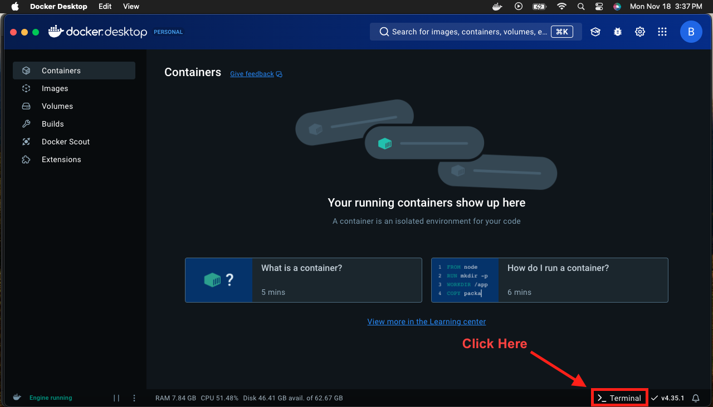

# Hadoop and Spark Tutorial (Docker Version)

## Getting Started 
1. Clone the repository: `git clone [repository_url]`
2. Install [Docker Desktop](https://www.docker.com/products/docker-desktop/)
3. Open terminal in Docker Desktop

4. In the Docker Desktop terminal:
   - Navigate to cloned repository directory:
       ```bash
       cd [Path_To_Where_You_Cloned_Repo_Locally]
       ```
   - Build and start containers using docker-compose file: ***This may take a while...***
       ```bash
       docker-compose up --build
       ```
     ***Note:*** To close containers just press `ctrl c` in the Docker Desktop terminal window. 

### Helpful Docker Commands
- Start already built containers:
    ```bash
    docker-compose up
    ``` 
- Delete containers and volumes:
    ```bash
    docker-compose down -v
    ``` 
- Enter container terminal:
    ```bash
    docker exec -it -u [username] [container_name] bash
    ```

- Copy file from local machine to container:
    ```bash
    docker cp [path_to_file] [container_name]:[directory_in_container]
    ```

## Part 1: Basic Setup Verification

1. First, verify all services are running in a separate bash terminal:
```bash
docker ps
```
You should see containers for: namenode, datanode, spark-master, and spark-worker

2. Verify you can access the web interfaces:
- Hadoop NameNode UI: http://localhost:9870
- YARN Resource Manager: http://localhost:8088
- Spark Master UI: http://localhost:8080

## Part 2: Running MapReduce Example

1. From your local machine navigate to repository directory:
    ```bash
    cd [Path_To_Where_You_Cloned_Repo_Locally]
    ```

2. Copy files to the Namenode container:
```bash
docker cp scripts/mapper.py namenode:/home/hadoop/scripts
docker cp scripts/reducer.py namenode:/home/hadoop/scripts
docker cp scripts/input.txt namenode:/home/hadoop/scripts
```

6. Enter the Namenode container:
```bash
docker exec -it -u hadoop namenode bash
```

7. Test MapReduce locally inside the container:
```bash
cat /home/hadoop/scripts/input.txt | /home/hadoop/scripts/mapper.py | sort -k1,1 | /home/hadoop/scripts/reducer.py
```

8. Run on HDFS:
```bash
# Create HDFS directory
hdfs dfs -mkdir -p /user/hadoop/scripts

# Copy input file to HDFS
hdfs dfs -copyFromLocal /home/hadoop/scripts/input.txt /user/hadoop/scripts/

# Run the MapReduce job
hadoop jar /opt/hadoop/share/hadoop/tools/lib/hadoop-streaming-*.jar \
    -files /home/hadoop/scripts/mapper.py,/home/hadoop/scripts/reducer.py \
    -mapper mapper.py \
    -reducer reducer.py \
    -input /user/hadoop/scripts/input.txt \
    -output /user/hadoop/scripts/output

# View results
hdfs dfs -cat /user/hadoop/scripts/output/*
```

9. Exit namenode:
```bash
exit
```

## Part 3: Working with Spark on top of HDFS Cluster 
### Creating Directories and Moving Files
1. Make directory in HDFS:
```bash
docker exec -it -u hadoop namenode hdfs dfs -mkdir /spark-history/
```
***Note:*** You can see if directory is created at http://localhost:9870/explorer.html

2. Create the `/user/spark/` Directory in HDFS from Namenode for Spark JARs:
```bash
docker exec -it -u hadoop namenode hdfs dfs -mkdir -p /user/spark/
```

3. Copy the JARs from the Spark container to local machine:
```bash
docker cp spark-master:/opt/spark/jars ./ 
```

4. Move JARs from local machine to Namenode container:
```bash
docker cp ./jars namenode:/tmp/ 
```

5. Remove JARs from local machine:
```bash
rm -R ./jars 
```
***Note:*** Use `rmdir /s /q .\jars` for Windows Command Prompt.

6. Upload the copied JARs to HDFS from the Namenode container:
```bash
docker exec -it -u hadoop namenode hdfs dfs -put /tmp/jars /user/spark/
```
### Example 1: Calculate Pi
From your local machine:
```bash
docker exec -it spark-master spark-submit --master spark://spark-master:7077 --class org.apache.spark.examples.SparkPi /opt/spark/examples/jars/spark-examples_2.12-3.5.0.jar 10
```
***Note:*** See in browser http://localhost:8080, one application is completed
### Example 2: Interactive PySpark with Titanic Dataset

1. Copy the Titanic dataset to the Namenode container:
```bash
docker cp datasets/titanic.csv namenode:/home/hadoop/
```

2. Put file in HDFS:
```bash
docker exec -it -u hadoop namenode hdfs dfs -put /home/hadoop/titanic.csv /
```
***Note:*** See contents in HDFS at http://localhost:9870/explorer.html or with `docker exec -it -u hadoop namenode hdfs dfs -ls /`

3. Start PySpark shell:
```bash
docker exec -it spark-master pyspark --master spark://spark-master:7077
```

4. In the PySpark shell:
```python
df = spark.read.format("csv").option("header", True).option("separator", ",").load("hdfs://namenode:9000/titanic.csv")
df.show()
```

5. When finished exit PySpark shell:
```bash
exit()
```
### Example 3: Running a Spark Script

1. Copy pyspark script to the Spark-master container:
```bash
docker cp scripts/pyspark-script.py spark-master:/opt/spark/
```

2. Run the script from the Spark-master container:
```bash
docker exec -it spark-master spark-submit /opt/spark/pyspark-script.py
```
***Note:*** While script is running you can see the jobs being run at http://localhost:4040

### Example 4: Use of an ML in Spark
1. Copy train and test data to `/home/hadoop` in Namenode container:
```bash
docker cp datasets/test.csv namenode:/home/hadoop
docker cp datasets/train.csv namenode:/home/hadoop
```
2. Load both files to HDFS:
```bash
docker exec -it -u hadoop namenode hdfs dfs -put /home/hadoop/test.csv /home/hadoop/train.csv /
```
3. Copy `ml_titanic.py` script to the Spark-master container:
```bash
docker cp scripts/ml_titanic.py spark-master:/opt/spark/
```

3. Run `ml_titanic.py` script from the Spark-master container:
```bash
docker exec -it spark-master spark-submit /opt/spark/ml_titanic.py
```
***Note:*** While script is running you can see the jobs being run at http://localhost:4040
## Cleanup

To stop all services:
```bash
docker-compose down
```

To stop services but keep the data volumes:
```bash
docker-compose stop
```

To start services back up again:
```commandline
docker-compose up
```

## Web Interface URLs
- Hadoop NameNode: http://localhost:9870
- YARN Resource Manager: http://localhost:8088
- Node Manager: http://localhost:8042
- Spark Master: http://localhost:8080
- Spark Application UI (when running): http://localhost:4040

## Notes
- All commands assume you're in the directory containing your docker-compose.yml
- Data persists in Docker volumes between restarts unless you use `docker-compose down -v`
